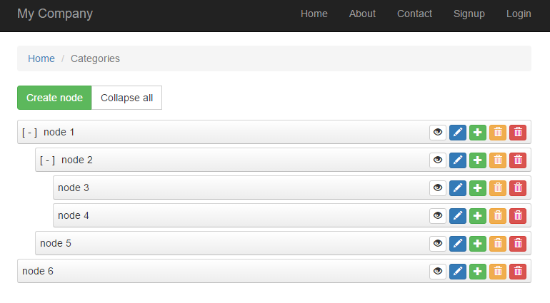

# yii2-category v0.0.12 (README)

Allows user to create multilevel category from their desire table for the Yii2.

[](https://packagist.org/packages/yongtiger/yii2-category)
[](https://packagist.org/packages/yongtiger/yii2-category) 
[](https://packagist.org/packages/yongtiger/yii2-category)
[](https://packagist.org/packages/yongtiger/yii2-category)

## FEATURES

* Create Unlimited Multilevel categories
* Complete category management (create, update, delete, deleteAll, etc.)
* Visualize category tree structure




## DEPENDENCES

* [yongtiger/yii2-tree-manager](https://github.com/yongtiger/yii2-tree-manager)


## INSTALLATION   

The preferred way to install this extension is through [composer](http://getcomposer.org/download/).

Either run

```
php composer.phar require --prefer-dist yongtiger/yii2-category "*"
```

or add

```json
"yongtiger/yii2-category": "*"
```

to the require section of your composer.json.


## CONFIGURATION

### Module category 

```php
'modules' => [
	'category' => [
	    'class' => 'yongtiger\category\Module',
	    'tableName' => '{{%category_nested_sets}}',
	    // 'tableName' => '{{%category_adjacency_list}}',
	],
	// ...
],
```

### Module treemanager 

```php
'modules' => [
	'treemanager' => [
	    'class' => 'yongtiger\tree\Module',
	    'behaviors' => [
	        'tree' => [
	            'class' => \creocoder\nestedsets\NestedSetsBehavior::className(),
	            // 'class' => \paulzi\nestedsets\NestedSetsBehavior::className(),
	            ///To disable the `creocoder/yii2-nested-sets` multiple tree, set to `false`. @see https://github.com/creocoder/yii2-nested-sets
	            ///To disable the `paulzi/yii2-nested-sets` multiple tree, set to `null`. @see https://github.com/paulzi/yii2-nested-sets
	            'treeAttribute' => 'tree',  ///multiple tree mode for nested-sets 
	            // 'leftAttribute' => 'lft',
	            // 'rightAttribute' => 'rgt',
	            // 'depthAttribute' => 'depth',
	        ],
	        // 'tree' => [
	        //     'class' => \paulzi\adjacencyList\AdjacencyListBehavior::className(),
	        // ],
	    ],
	    // 'isOpAllTransactions' => false,  ///Must set to `true` while using `creocoder/yii2-nested-sets` and `paulzi/yii2-nested-sets`.
	    // 'queryClass' => 'common\models\CategoryQuery',
	],
	// ...
],
```


## USAGES

```
http://localhost/index.php?r=category
```


## NOTES


## DOCUMENTS


## REFERENCES


## SEE ALSO


## TBD


## [Development roadmap](docs/development-roadmap.md)


## LICENSE 
**yii2-category** is released under the MIT license, see [LICENSE](https://opensource.org/licenses/MIT) file for details.
